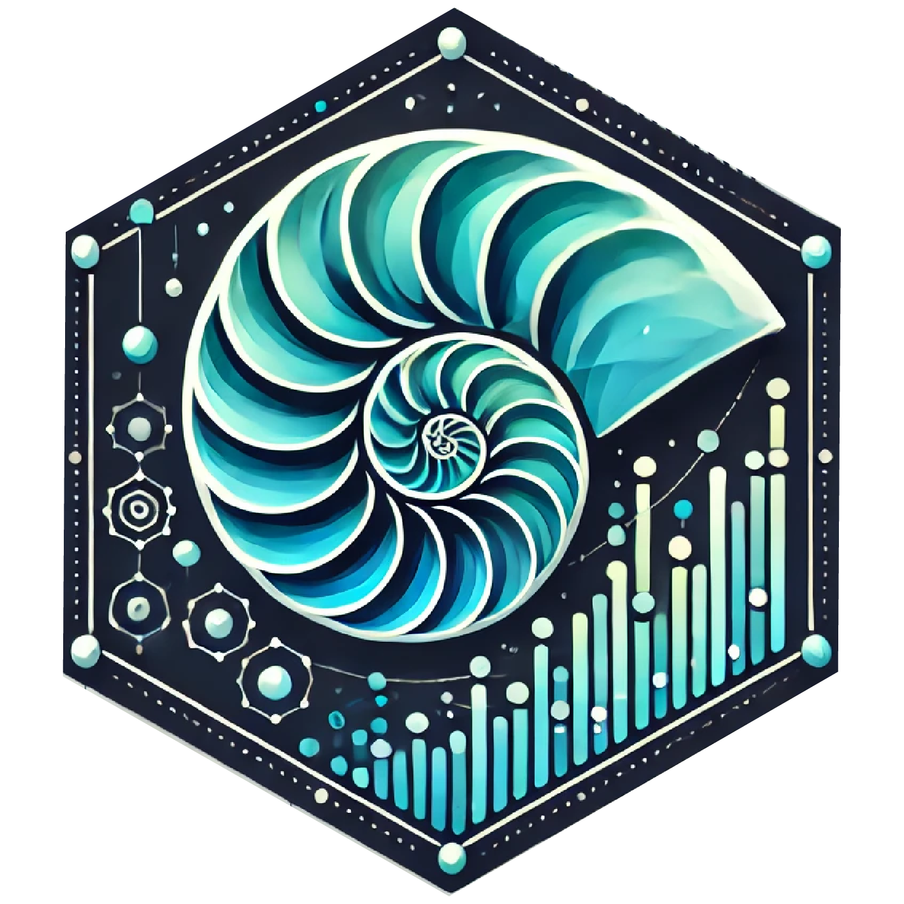

# nautilus 

<!-- badges: start -->
[](https://www.repostatus.org/#wip)
[](https://lifecycle.r-lib.org/articles/stages.html#experimental)
[](https://github.com/miguelgandra/nautilus/actions/workflows/R-CMD-check.yaml)
<!-- badges: end -->
<!-- CRAN badge omitted until the package is published; www.r-pkg.org 500s for packages not yet on CRAN.
     Re-add on acceptance:
     [](https://CRAN.R-project.org/package=nautilus) -->

**nautilus** turns raw, high-resolution archival-tag recordings into analysis-ready
biologging datasets. It takes the multi-sensor time series logged by animal-borne tags
&mdash; depth, temperature, tri-axial acceleration, magnetometer and gyroscope, plus any
onboard camera video &mdash; and carries them through a single, transparent pipeline:
import, quality control, sensor-axis alignment, magnetometer calibration, and the
derivation of orientation, kinematics, swimming speed and dead-reckoned movement tracks.

It was designed around CATS Diary and Camera tags mounted in the towed **PILOT**
multi-sensor packages ([Fontes et al., 2022](https://doi.org/10.1186/s40317-022-00310-1)),
but the workflow is general and adapts to other high-rate archival tags.

> **Status.** nautilus is under active development ahead of its first release. The public
> API is stabilising but may still change; please pin a commit if you depend on it in a
> production analysis.

<br/>

## The workflow

Every deployment follows the same **mandatory spine** &mdash; prepare, clean, orient &mdash;
which converges on a single call, `processTagData()`, that returns one self-describing
`nautilus_tag` object. From there the analysis **fans out into optional branches** that you
pick according to your scientific goal.

<p align="center">
  
</p>

The [Getting Started guide](#learning-more) walks through this diagram end to end on a real
deployment.

<br/>

## What nautilus does

**Prepare and import**
- Validate and normalise the deployment table before import (`checkDeploymentMetadata()`),
  mapping arbitrary column names onto canonical roles (`metadataColumns()`).
- Read each animal's multi-sensor CSVs, standardise sensor names and units, fold in
  Wildlife Computers location files, and store everything as a `nautilus_tag` object
  (`importTagData()`).

**Clean and quality-control**
- Detect the on-animal deployment window and trim pre-/post-deployment noise
  (`filterDeploymentData()`); place the record on a regular time grid
  (`regularizeTimeSeries()`).
- Diagnose and optionally repair sensor faults &mdash; duplication, dead channels, spikes
  (`checkSensorIntegrity()`, `checkSensorQuality()`); then screen the position fixes for
  implausible GPS/Argos detections (`filterLocations()`).

**Orient and calibrate**
- Resolve and apply the signed-permutation transform that rotates each tag's IMU axes into
  the animal's body frame, with a per-package consensus that can rescue weakly-observed
  deployments (`checkTagMapping()`, `consensusAxisMapping()`, `applyAxisMapping()`).
- Estimate hard- and soft-iron magnetometer corrections from free-swimming data, with an
  explicit, honest heading-confidence flag (`calibrateMagnetometer()`).

**Process** &mdash; the single pivot
- Derive orientation (tilt-compensated compass or Madgwick fusion), kinematics, dynamic
  body acceleration and paddle-wheel swimming speed in one call (`processTagData()`).

**Then branch by goal**
- **Summaries & figures:** `summarizeTagData()`, `plotDepthProfiles()`, `plotTimeAtDepth()`, `plotDistributions()`.
- **Dive analysis:** detect vertical excursions by two-threshold hysteresis against a chosen reference &mdash; the surface for air-breathers, a running baseline for fish that never surface, inverted for benthic resters &mdash; then reduce to one row per dive and compare deployments: `diveControl()`, `detectDives()`, `diveMetrics()`, `plotDives()`.
- **Behaviour & kinematics:** `calculateTailBeats()`, `extractFeatures()` (sliding-window features for machine learning), `getDielPhase()`.
- **Movement tracks:** dead-reckon a pseudo-track and validate it against held-out fixes &mdash; `reconstructTrack()`, `crossValidateTrack()`, `trackMetrics()`, `plotTracks()`, `exportForSSM()`.
- **Onboard video:** recover recording timestamps (with an OCR fallback), align sensor data to filmed intervals, annotate behaviours and render sensor overlays &mdash; `getVideoMetadata()`, `filterVideoPeriod()`, `annotateData()`, `renderOverlayVideo()`.

<br/>

## Installation

Install the development version from GitHub:

```r
# install.packages("remotes")
remotes::install_github("miguelgandra/nautilus")
```

nautilus has a deliberately light dependency footprint and needs **no geospatial system
libraries** (no GDAL/GEOS/PROJ). A few *optional* branches shell out to external tools when
you use them:

| Feature | Optional tool |
|---|---|
| Video re-encoding / overlay rendering | [FFmpeg](https://ffmpeg.org/) |
| In-R video playback (`launchVideo()`) | [VLC](https://www.videolan.org/) |
| On-screen-clock OCR (`getVideoMetadata()`) | R package **tesseract** |

The fine-tuned camera-tag OCR model (~11 MB) is **not** bundled with the package: it is
downloaded on first use and cached locally, or you can fetch it ahead of time with
`installCamOcrModel()`. Offline, OCR falls back gracefully to Tesseract's generic model.

<br/>

## A minimal pipeline

The mandatory spine is a short, linear sequence; each step reads a `nautilus_tag` and
returns an annotated one.

```r
library(nautilus)

# --- Mandatory spine: prepare, clean, orient --------------------------------
meta <- checkDeploymentMetadata("deployments.csv")        # validate deployment metadata
tags <- importTagData(data.folders = "tag-data/",      # -> one nautilus_tag per animal
                      metadata  = meta)

tags <- filterDeploymentData(tags)                     # trim to the on-animal period
tags <- regularizeTimeSeries(tags)                     # place on a regular time grid

mapping <- consensusAxisMapping(checkTagMapping(tags)) # resolve tag -> body axes
tags    <- applyAxisMapping(tags, mapping)
tags    <- calibrateMagnetometer(tags)                 # hard-/soft-iron correction

# --- The single pivot -------------------------------------------------------
tags <- processTagData(tags)                           # orientation, kinematics, speed

# --- Optional branches: choose by your goal ---------------------------------
summarizeTagData(tags)                                 # per-deployment overview
```

Large studies can run each stage straight to disk (`return.data = FALSE` plus an `output.dir`)
instead of holding every deployment in memory &mdash; each stage then returns the written file paths,
which feed straight into the next. The Getting Started guide covers both styles.

<br/>

<h2 id="learning-more">Learning more</h2>

- **Vignettes** &mdash; long-form guides shipped with the package. Start with *Getting
  Started with nautilus*, which introduces the pipeline, helps you choose a workflow, and
  runs a complete example. List them with:

  ```r
  browseVignettes("nautilus")
  vignette("getting-started", package = "nautilus")
  ```

- **Function reference** &mdash; every exported function is documented with runnable
  examples; open help with `?processTagData` (or any other function name).
- **Changelog** &mdash; see [`NEWS.md`](NEWS.md) for what is new in each version.
- **Worked scripts** &mdash; the [`tutorials/`](tutorials/) directory holds end-to-end
  example scripts used during development.

<br/>

## Citing `nautilus`

If you use nautilus in your research, please cite it as:

```r
citation("nautilus")
```

Until the accompanying methods paper is published, the recommended citation is:

> Gandra, M., Saraiva, B. M., Macena, B. C. L., Afonso, P., &amp; Fontes, J. (2026).
> nautilus: An R package for biologging data processing and analysis. GitHub.
> <https://github.com/miguelgandra/nautilus>

No version is quoted above on purpose: `citation("nautilus")` reads it from the package you
actually have installed, so that call is the single source of truth and cannot drift from this
file. Please include the version it reports.

<br/>

## Related publications

Work associated with the package, the tagging system it was built around, or the datasets it was
developed on:

> Fontes, J., Macena, B., Solleliet-Ferreira, S., Buyle, F., Magalh&atilde;es, R.,
> Bartolomeu, T., Liebsch, N., Meyer, C. &amp; Afonso, P. (2022). The advantages and challenges
> of non-invasive towed PILOT tags for free-ranging deep-diving megafauna. *Animal
> Biotelemetry, 10*(1), 39. <https://doi.org/10.1186/s40317-022-00310-1>

<br/>

## Getting help

Found a bug, or something unclear? Please
[open an issue](https://github.com/miguelgandra/nautilus/issues) with a small reproducible
example.

<br/>

## License

GPL (>= 3). See [`LICENSE.md`](LICENSE.md) for the full license text.
