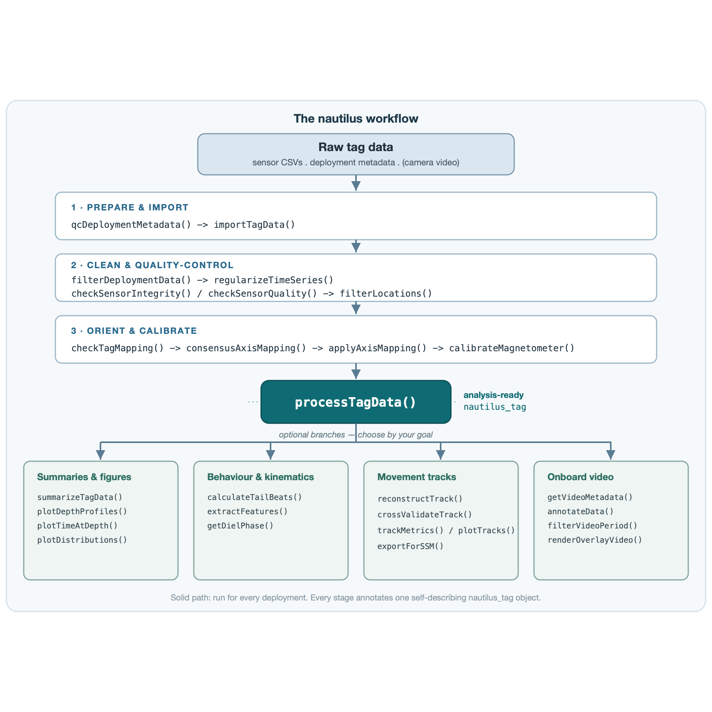

```{r setup, include = FALSE}
knitr::opts_chunk$set(
  collapse = TRUE,
  comment  = "#>",
  eval     = FALSE
)
```

This guide introduces the `nautilus` package: the idea behind it, the shape of its
pipeline, the data you need to get started, and a complete walkthrough of a single
deployment from raw sensor files to analysis-ready output. By the end you should know which
functions to call, in what order, and how to choose the analysis that matches your
scientific question.

The code below is illustrative -- it shows the real function calls in the order you run
them, but the chunks are not executed here because processing a deployment requires your own
tag files.

## nautilus in one idea

Animal-borne archival tags record several sensors at high rates -- depth, temperature,
tri-axial acceleration, magnetometer and gyroscope, and sometimes onboard camera video.
Turning those raw logs into something you can analyse involves a long chain of decisions:
where the deployment actually began and ended, how the tag was oriented on the animal, how
to correct the magnetometer, how to fuse the sensors into a heading, and how far to trust
the result.

nautilus makes that chain **explicit and reproducible**. The whole workflow revolves around
a single object -- a `nautilus_tag` -- that every function reads and returns, annotating it
as it goes. Each stage records what it did and what it found, so the object carries its own
processing history and quality flags with it. Two principles run through the package:

- **One object, one pipeline.** You rarely juggle intermediate data frames. Import produces
  a `nautilus_tag`; every later step takes one and returns an enriched one.
- **Honest uncertainty.** Where a result is only as good as the data allows -- a heading
  from an under-observed magnetometer, a dead-reckoned track between sparse fixes --
  nautilus surfaces that limitation rather than hiding it.

## The workflow at a glance

Every deployment follows the same **mandatory spine** -- prepare, clean, orient -- which
converges on a single call, `processTagData()`. That call returns the analysis-ready
`nautilus_tag`, from which the workflow **fans out into optional branches** chosen by your
goal.

```{r workflow-diagram, echo = FALSE, eval = TRUE, out.width = "100%", fig.alt = "The nautilus workflow. Raw tag data flows through a mandatory linear spine (1: prepare and import; 2: clean and quality-control; 3: orient and calibrate) into processTagData(), which produces an analysis-ready nautilus_tag object and then fans out into four optional branches: summaries and figures, behaviour and kinematics, movement tracks, and onboard video."}

```

The solid path runs for every deployment. The branches are independent: run only the ones
your study needs.

## Before you start: what data you need

nautilus expects two inputs, plus an optional third:

**1. Sensor files, one folder per animal.**
Each deployment lives in its own folder, and the sensor CSVs sit in a subdirectory within
it (named `"CMD"` by default). A study directory therefore looks like:

```
tags/
  shark01/
    CMD/            <- sensor CSV files for shark01
  shark02/
    CMD/
  ...
```

**2. A deployment metadata table**, one row per animal, describing each deployment. You do
not have to rename your columns: `metadataColumns()` maps your own column names onto the
roles nautilus needs. Five roles are required -- an ID, the tag model, the deployment
date-time, and the deployment longitude and latitude -- and many more are optional (recovery
and pop-up positions, a package/logger identifier, an axis configuration, paddle-wheel
presence, animal traits, and so on).

```{r metadata}
# Your metadata table (any column names you like)
meta_table <- read.csv("deployments.csv")

# Tell nautilus which of your columns fill which roles.
# Defaults already match ID / tag / tagging_date / deploy_lon / deploy_lat,
# so you only override what differs:
cols <- metadataColumns(
  id              = "ID",
  tag_model       = "tag",
  deploy_datetime = "tagging_date",
  deploy_lon      = "deploy_lon",
  deploy_lat      = "deploy_lat"
)
```

**3. (Optional) Onboard camera video** and Wildlife Computers location files, if your tags
recorded them. Wildlife Computers data (e.g. a `Locations.csv`) can be folded in
automatically from a subfolder; video is handled by a dedicated branch (see
[Choosing your workflow](#choosing-your-workflow)).

## Installing nautilus

```{r install}
# install.packages("remotes")
remotes::install_github("miguelgandra/nautilus")
```

nautilus has a light dependency footprint and needs no geospatial system libraries. A few
optional branches shell out to external tools only when you use them -- **FFmpeg** for video
re-encoding and overlays, **VLC** for in-R playback, and the R package **tesseract** for
reading an on-screen video clock. The fine-tuned camera-tag OCR model is downloaded on first
use (or ahead of time with `installCamOcrModel()`), so nothing large is bundled.

## Processing a deployment, step by step

The mandatory spine is a short linear sequence. Load the package and validate the metadata
first:

```{r spine-prepare}
library(nautilus)

# Validate and normalise the deployment metadata before anything else.
meta <- checkDeploymentMetadata("deployments.csv", columns = cols)

# Import each animal's sensor CSVs into nautilus_tag objects.
# `data.folders` points at the per-animal folders; `metadata` is the table above.
tags <- importTagData(
  data.folders        = list.dirs("tags", recursive = FALSE),
  sensor.subdirectory = "CMD",
  metadata         = meta,
  columns             = cols
)
```

`importTagData()` standardises sensor names and units, folds in any Wildlife Computers
locations, and returns a **named list -- one `nautilus_tag` per animal, keyed by ID**. Every
later pipeline function accepts that list, so you rarely index into it; but when you want to
look at a single deployment, pull one element out. Each carries its own consolidated metadata
and processing history:

```{r inspect}
tag1 <- tags[[1]]        # a single deployment (or tags[["PIN_01"]] by ID)
tagMetadata(tag1)        # the consolidated metadata record
processingHistory(tag1)  # what has been done to the data so far
```

### If your data isn't a folder of CATS files

`importTagData()` reads the CATS archival/camera format. If your tag is a different make (say a
Little Leonardo logger), or your sensor data is already in R (exported from another tool, or parsed
by your own reader), skip the file reader and build the `nautilus_tag` directly from a data frame with
`buildTagData()`:

```{r byo}
# a data frame with one row per sample: a POSIXct `datetime` (or a start time + rate for
# loggers that store no clock) and canonical sensor columns (ax/ay/az, and optionally
# mx/my/mz, gx/gy/gz, depth, temp). Columns under other names are renamed via `sensor.mapping`.
tag <- buildTagData(
  my_sensor_df, id = "LL01",
  start = as.POSIXct("2025-07-21 22:33:00", tz = "UTC"),   # only needed if there is no datetime column
  sampling.rate = 100,                                     # Hz
  metadata = my_deployments_row                            # optional: a checkDeploymentMetadata() row
)
```

The result is an ordinary `nautilus_tag`, so it feeds the same pipeline
(`processTagData()`, `checkTagMapping()`, ...) from here on. **Magnetometer- and gyroscope-free tags are
fully supported**: with `ax/ay/az` plus `depth`, `processTagData()` returns ODBA/VeDBA, surge/sway/heave
and pitch/roll from acceleration alone (heading is left `NA`), and `checkTagMapping()` still resolves the
tag-to-body axes from gravity and diving dynamics -- no magnetometer or gyroscope required.
(`processTagData()` does need a `depth` channel; the constructor itself does not.)

Next, clean the record and place it on a regular time grid:

```{r spine-clean}
# Detect the on-animal window and trim pre-/post-deployment noise.
tags <- filterDeploymentData(tags)

# Interpolate onto a regular time grid (needed by downstream kinematics).
tags <- regularizeTimeSeries(tags)

# Optionally diagnose and repair sensor faults (dead channels, spikes, ...).
# Both return list(curated_data = <tags>, issues = <report>); with apply = TRUE the
# curated_data has faulty channels dropped/repaired. Keep the tags, inspect $issues as needed.
tags <- checkSensorIntegrity(tags, apply = TRUE)$curated_data
tags <- checkSensorQuality(tags, apply = TRUE)$curated_data

# Screen the position fixes too (the location channel): remove GPS/Argos fixes implying an
# impossible speed or computed from too few satellites. Thresholds are species-specific and opt-in.
tags <- filterLocations(tags, max.speed.kmh = 10, min.satellites = 4)
```

Then resolve the tag's orientation on the animal and calibrate the magnetometer. The axis
mapping determines the signed-permutation transform that rotates the tag's IMU axes into the
animal's body frame; `consensusAxisMapping()` pools evidence across a deployment package so
weakly-observed tags can borrow strength from their neighbours:

```{r spine-orient}
# Resolve tag -> body axes, then apply the transform.
mapping <- consensusAxisMapping(checkTagMapping(tags))
tags    <- applyAxisMapping(tags, mapping)

# Estimate hard-/soft-iron magnetometer corrections from free-swimming data.
tags <- calibrateMagnetometer(tags)
```

A note on the last step: because a level-swimming animal only samples a thin band of
orientations, the magnetometer fit can be under-determined. `calibrateMagnetometer()` does
not pretend otherwise -- it attaches an explicit heading-confidence flag and, for thin
bands, proposes a hard-iron-only correction whose trustworthiness is judged by in-plane
rotational coverage. The calibration is only *applied* downstream when it is trusted.

Finally, the single pivot. `processTagData()` derives orientation (a tilt-compensated
compass by default, or Madgwick sensor fusion), kinematics, dynamic body acceleration and
paddle-wheel swimming speed, applying the magnetometer calibration when it is trusted:

```{r spine-process}
tags <- processTagData(tags)
```

The result is your analysis-ready `nautilus_tag`. From here you branch.

## Choosing your workflow {#choosing-your-workflow}

The five branches are independent -- run only what your question needs.

**Summaries and figures.** Per-deployment overviews and the core diagnostic plots.

```{r branch-summary}
summarizeTagData(tags)
plotDepthProfiles(tags)
plotTimeAtDepth(tags)
plotDistributions(tags)
```

**Dive analysis.** Detect vertical excursions, reduce them to one row per dive, and compare
deployments. The `reference` is the one choice that makes this taxon-general: `"surface"` for an
air-breather, whose zero its own surfacing anchors; `"baseline"` for a fish that never surfaces, where
a fixed surface threshold would find a single dive spanning the whole record; and `direction = "up"`
for a benthic rester, whose excursions leave the bottom. `"auto"` reads the zero-offset provenance and
reports what it chose -- on a real cohort it resolves to a mixture, which is worth knowing before
comparing absolute depths between animals.

```{r branch-dives}
tags <- detectDives(tags, control = diveControl(depth.threshold = 5))
dives <- diveMetrics(tags)
plotDives(dives, metrics = c("amplitude_m", "duration_s"))
```

`plotDives()` draws every dive as a point rather than a bar of per-individual maxima, and defaults to
`amplitude_m` (measured from each dive's own baseline) rather than `max_depth_m` -- under a baseline
reference an absolute depth carries a seabed offset that is not diving.

**Behaviour and kinematics.** Tail-beat frequency, sliding-window features for machine
learning, and diel-phase classification.

```{r branch-behaviour}
calculateTailBeats(tags)
extractFeatures(tags)
getDielPhase(tags)
```

**Movement tracks.** Dead-reckon a pseudo-track from heading, speed and depth, anchored to
known fixes -- and, crucially, validate it against held-out fixes before you trust it.

```{r branch-tracks}
track <- reconstructTrack(tags)
crossValidateTrack(tags)   # accuracy against held-out GPS/Argos fixes
trackMetrics(track)
plotTracks(track)
exportForSSM(track)        # prepare input for a state-space model
```

**Onboard video.** Recover recording timestamps (with an OCR fallback for the on-screen
clock), align sensor data to filmed intervals, annotate behaviours, and render sensor
overlays.

```{r branch-video}
getVideoMetadata("video/")
filterVideoPeriod(tags)
annotateData(tags)
renderOverlayVideo(tags)
```

## Working at scale

Most pipeline functions accept the same disk-oriented arguments, so a large study never has
to hold every deployment in memory at once. Every function takes an `output.dir`: providing one
is what triggers saving (a `NULL` directory writes nothing). Combined with `return.data = FALSE`,
each deployment is written to disk instead of being kept in memory, and the function returns the
**written file paths** -- which feed straight into the next stage's `data` argument:

```{r at-scale}
paths <- importTagData(
  data.folders = list.dirs("tags", recursive = FALSE),
  metadata  = meta,
  columns      = cols,
  return.data  = FALSE,
  output.dir   = "processed"
)
tags <- filterDeploymentData(paths, output.dir = "filtered", return.data = FALSE)
```

You can then process the saved objects one at a time. In-memory and on-disk styles use the
same functions and arguments; only where the data lives changes.

## Where to go next

- **Function reference.** Every exported function is documented with runnable examples.
  Open help with `?processTagData`, `?calibrateMagnetometer`, or any other function name.
- **More vignettes.** Browse the full set with `browseVignettes("nautilus")` as they are
  added.
- **Changelog.** See `news(package = "nautilus")` for what is new in each release.
- **Questions and bugs.** Please open an issue at
  <https://github.com/miguelgandra/nautilus/issues> with a small reproducible example.
